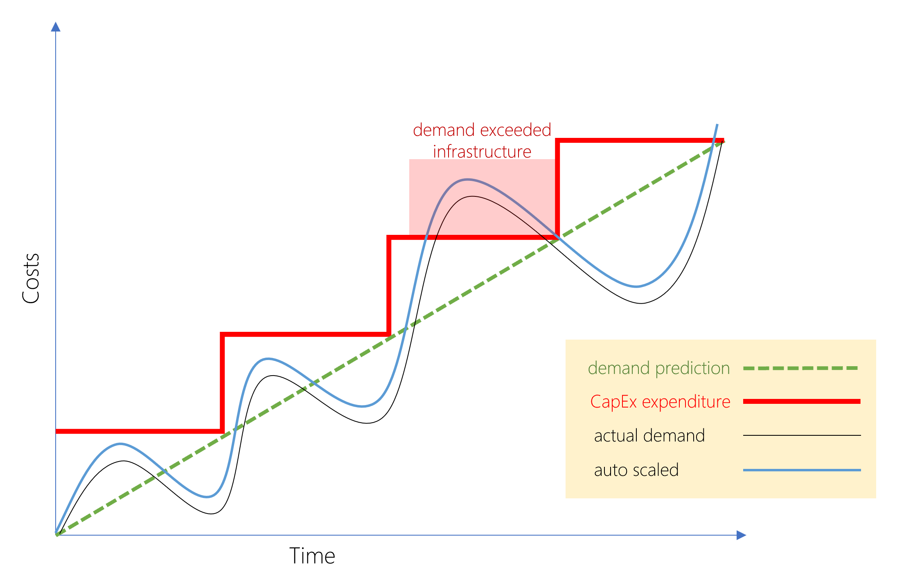

# Capital expenditure (CapEx) versus operational expenditure (OpEx)

Previously, companies needed to acquire physical premises and infrastructure to start their business. This is a big upfront cost - cloud computing provides the same services to customers without this cost.

These two approaches are called:

- Captial expenditure (CapEx)
- Operational expenditure (OpEx)

CapEx is the spending of money on physical infrastructure up front, which has value that reduces over time.

OpEx is spending money on services and products now and getting billed for them now.

## CapEx computing costs

### Server costs

This includes all the actual hardware components themselves and the costs of maintaining and supporting them. When purchasing servers, make sure to design fault tolerance and redundancy.

This is to deal with server clustering, redundant power supplies, uninterruptible power supplies. When a server needs to be replaced or added to the datacenter, this needs to be paid for upfront.

### Storage costs

Based on the app and level of fault tolerence centralised storage can be pricey. For large organisations you can create tiers of storage; expensive fault tolerant storage being used for critical apps, and the cheaper storage getting used for lower priority data.

### Network costs

This includes all the hardware stuff like cables, switches, access points and routers.

### Backup

This is stuff like backing data up to tape, or setting up a backup to or from the cloud.

### Disaster costs

Along with server fault tolerance you also gotta plan for how to recover from a disaster. This will consist of creating a disaster recovery site, it can also include backup generators.

### Datacenter infrastructure costs

These are costs for actually building the datacenter - think of the tools needed, as well as remodelling costs that may arise as demands grow. Also the operational costs like electricity, cooling, and building maintenance.

### Technical personnel

Gotta pay people to work on your infrastructure after all. An organisation will need technical expertise to install, deploy and manage the systems in the datacenter and at the disaster recover site.

---

## OpEx cloud computing costs

With cloud computing pretty much all of the above costs shift from the organisation to the cloud provider. They do however get replaced by a different set of costs.

### Leasing software

The organisation is essentially subscribing to software in the cloud, and that needs to be managed so that the users do not misuse the services and that provisioned accounts are being used and not wasted. As soon as the cloud provider provisions resources, the billing starts.

### Scaling charges

Cloud computing can bill in various ways:

- Number of users
- CPU usage time
- Allocated Ram
- I/O operations per second (IOPS)
- Storage space

### Billing

The subscription (pay-per-use) model is a computing billing method that is designed for both organisations and individual users.

The organisation or user is billed for the services used on a recurring basis.

---

## Benefits of CapEx

With capital expenditure your expenses come with the initialisation of a project or budget period. You purchase a bunch of resources at the start and expect them to last you the duration of the project or budget period.

Demand and growth can be unpredictable and can outpace expectation which causes this model problems.

## Benefits of OpEx

With operation expenditure no investment in equipment is needed, pay as much or as little as needed. This model is appealing if demand is unknown or heavily fluctuates. Cloud services are said to be Agile.

