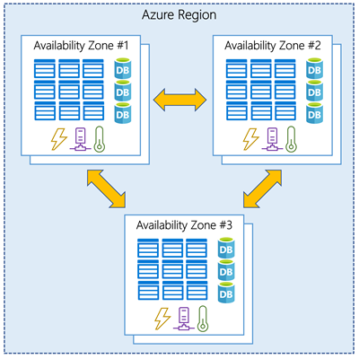

# Understand Availability Zones in Azure

You wanna ensure your services and data are redundant so you can protect them in case of failure.

This basically means you gotta create duplicate hardware environments. This is referred to as being highly available - your app and data is always available even if the hardware goes down - because you have other hardware also serving your app and data.

Azure can make your app highly available through Availability Zones.

## Availability Zones

Availability Zones are physically seperate datacenters within an Azure region.

Each zone is comprised of at least one datacenter with independent power, cooling and networking.

The point is that if one zone goes down the other(s) continue working. The zones are connected to each other through high speed, private fibre-optic networks.

## Supported Regions

Not every region has Availability Zones.

The following regions have a minimum of 3 zones to ensure resiliency

- Central US
- East Coast US 2
- West Coast US 2
- West Europe
- France Central
- North Europe
- Southeast Asia

Though, this list is expanding.

## Using Availabilty Zones in your apps

You can build high availibility into your app by co-locating your compute, storage, networking, and data within a zone and the replicating it in other zones. This will obviously increase costs.

Availability Zones are mostly for VMs, managed disks, load balancers and DBs.

Azure services that support Availability Zones are either:

- Zonal services - you pin the resource to a specific zone
- Zone-redundant services - the platform replicates accross zones automatically
