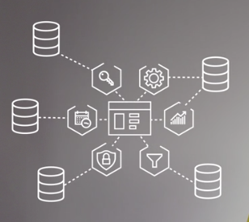

# Explore Containers in Azure

If you'd like to run multiple instances of an app on a single machine, containers are a great choice to do that.

A container is a runtime environment that sits ontop of a host OS that executes your app.

A container doesn't use virtualisation, so it doesn't waste resources simulating virtual hardware with an OS.

This typically makes containers more lightweight than VMs.

You can run multiple isolated apps on a single container host.

Since containers are isolated, you don't need seperate servers for each app.

## VMs versus containers

VMs provide an abstraction layer for CPU, Memory, Storage, Networking, etc

VMs can only run one OS at a time

So if you have multiple server apps that require different runtime environments, they may also require multiple VMs to execute properly.

VMs are also a comparatively sluggish in some aspects, like rebooting or starting one up, or taking a snapshot image. This is because it's emulating an entire computer.

---

Containers are a lighter weight solution that solves some of VMs troubles.

Containerising an app means bundling up the app code with all of it's dependencies.

Then we can deploy this containerised app as a unit to container host.

The containerised host abstracts away the OS and provides a standardised runtime environment.

This allows use to run multiple containerised apps on the same containerised host.

---

VMs virtualise the hardware, whereas containers virutalise the OS.

Azure supports multiple container variations, the most popular is Docker.

Spinning up a container is much faster than spinning up a VM, this is because you're just waiting for the app to launch, you're not also waiting for a computer to run the boot sequence and load the OS.

Containerised apps tend to be much smaller in size than a VM that contains the app.

Your development runtime environment can look exactly like your production environment

You can also use container cluster orchestration like Kubernetes to manage your containers, VMs do not have this option.

You can manage and deploy multiple containerised apps without worry which serve will host each container.

---

If you need to completely control your environment down to the OS - choose a VM

Anything else use a container bruh. You get portability, performance, better management, better development as you know if it works on dev it works on prod.

## Containers in Azure

Azure supports Docker containers (a standardised containers model), and there are several ways to manage container in Azure.

- Azure Container Instances (ACI)
- Azure Kubernetes Service (AKS)

### Azure Container Instances

ACI offers a fast and simple way to run a container in Azure.

You don't need to manage VMs.

It's a PaaS offering that lets you upload your containerised units and execute them.

### Azure Kubernetes Service

The task of managing and interacting with containers is known as container orchestration.

AKS is a container orchestration service, that supports containers with distributed architectures with multiple containers.

#### What is Kubernetes

We gotta manage our containerised applications at scale right. It only makes sense to use Kubernetes when you have dozens, or hundreds, or thousands of containers.

Kubernetes combines container management automisation with an extensible API, to create a management platform.

This platform is cloud native and lets you manage your containers and containerised apps.

Kubernetes has the concept of pods - which can consist of one or more containers - on a cluster node.

If one of the pods crashes, kubernetes can create a new instance of it.

If a cluster node is removed, kubernetes can move any affected workload to a different node in the cluster.

Kubernetes pods can be scaled to meet demands. Scaling can be manually triggered or automatically using kubernetes horizontal pod auto-scaling.

When updating an app kubernetes can stagger the deployment to minimize downtime.

Along with pod management, Kubernetes can also manage storage and network management.

Kubernetes persistent volumes can be used to present data storage to multiple containers.

This allows containers to read and write app data across many pod instances.

However, it is also common for apps running in kubernetes containers to use cloud based storage - like good ol' Azure storage and Azure Cosmos DB.

Regarding networking Kubernetes can: (via networking plugins):

- Expose pods to the internet
- Load balance traffic across multiple replicas of a pod
- Network isolation
- Policy driven network security

These networking plugins also manage communication and name resolution between pods in the cluster.

If all this wasn't enough, kubernetes capabilites can be extended using its API.

Kubernetes is a great platform to build on to create SaaS services.

---

## Using containers in your solutions

Containers are often used to create solutions using the microservice architecture. For example, you may split a website into a container hosting your front end, another container hosting your back end, and a third container for storage.

This allows us to split our app into sections that can be maintained, scaled and/or upadted independent of each other.

### What is a microservice

A microservice is just a web service that has a small well defined scope and is loosely couple from any other web service.

The entire application is then comprised of smaller self apps - microservices.

Each microservice should be self contained and responsible for a single business capability.

Each microservice can use its own technology stack, allowing the team responsible for that service to choose the right tool for the job.

A single team can build, test and deploy a microservice.

The idea of this is to have a faster release cycle and faster innovation.

It's easier to ramp up and get started for new team members because the scope and scale of the microservice is tightly defined.

Each microservice can be deployed independently of every other microservice.

A team can update an existing service without rebuilding and redeploying the **entire** application. There's no need to rebuild and redeploy any other microservice, other than the one you are updating.

Similiarly, the team can roll-back or roll-forward an update if something goes wrong with the microservice.

This makes bug fixes and feature releases less risky.

Each microservice can be scaled independently.

Each microservice is responsible for its own data or external state and does not rely on some common repository layer.

Some microservice experts think that each microservice should have its own database.

Again, this is so that each microservice is completely autonomous with no cross-dependencies from the business domain perspective.

This freedom provides a layer of fault isolation - if 1 microservice goes down it wont neccessarily take down the entire application.

Microservices can communicate with each other by using well defined APIs. The internal implementation details of the microservice are not exposed. These internal details are encapsulated behind their public interface.

But ideally you'd reduce these direct API calls that the microservices are making to one another, and introduce an orchestration layer in the higher level consuming application.

This higher level layer will co-ordinate API calls to microservices, and combines results.

This higher level layer is in the middle of all the microservices in the below picture. And each microservice in this picture also has its own dedicated database.

Choosing a microservices architecture is a good choice if you have:

- A high release velocity
- A highly scalable application
- Rich domains or many subdomains
- An organisation that consists of small development teams

As an example of the benefits of microservices, you have a website with a backend that has reached capacity, but your front end isn't being stressed; you can scale only the backend to improve performance.

Or you could change the storage that the backend is using, without affecting any other part of the app.

### Migrating apps to containers

You can move existing apps to containers and run them within AKS. You can control access via Azure Active Directory (Azure AD), and access service level agreement backed Azure Services, like Azure DB for MySQL.

The picture above depicts the following:

- Convert an existing app to one or more containers
- Publish one or more container images to the Azure Container Registry
- Use the Azure portal or CLI to deploy the containers to an AKS cluster
- Azure AD controls access to AKS resources
- Access SLA-backed Azure services, like Azure Database for MySQL, via OSBA.
- Optionally, AKS is deployed with a virtual network.
