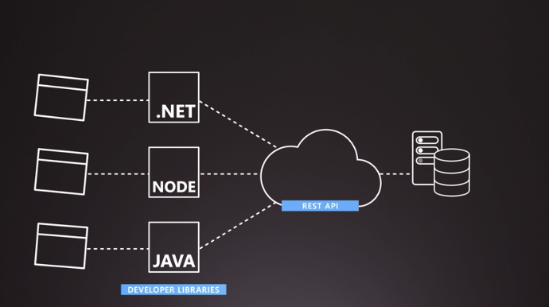

# Benefits of using Azure to store data

Azure data storage options are obviously cloud based, secure and stable.

Cloud storage providers usually have a standardised way to access data, for example: REST APIs.

Using a standard like this makes the data available to a big range of consumers; like application platforms.

Cloud providers also have multiple types of storage services for different data types.

For example, you may need to store large amount of binary video data, or update and delete structured data in columns in and tables.

These to different types need very different storage services.

So probably a storage blob for the former and MySQL for the latter.

To ensure data can be accessed quickly, cloud providers have multiple datacenters around the globe.

This allows you to store data closer to the users who request it, which in turn lowers their latency. And it helps you to replicate your data across multiple datacenters.

## Important benefits

- Automated backup and recovery - stops you losing data in there is a failure
- Replication across the globe - copies your data to protect it against hardware failure, you can choose to replicate your data at multiple locations worldwide
- Support for data analytics - analytics can be performed on your data consumption
- Encryption - data is encrypted to make it highly secure, you can also control who accesses the data
- Multiple data types - Azure can store almost any data type you need; video files, text files, even large binary files like virtual disks, also SQL and NoSQL data
- Data Storage in virtual disks - Azure can store up to 32TB of data in its virtual disks - this is useful for videos and simulations
- Storage tiers - this allows you to set tiers to prioritise access to data based on frequently used vs rarely used

# Types of data

There's 3 primary types that Azure Storage can hold:

- Structured

Structure data is data that adheres to a schema - all the data has the same fields or properties. Structured data can be stored in a DB with rows/columns. Structured data reiles on keys to indicate how one row in a table relates to data in another row of another table. Structured data is also referred to as relational data. Structured data is easy to enter, easy to query and easy to analyse.

- Semi-structured

Semi-structured data doesn't fit neatly into tables, rows and columns. Instead it uses tags or keys that organise and give hierarchy for the data. It's also known as non-relational or NoSQL data.

- Unstructured

Unstructured data has no restrictions of the kinds of data it can hold. For example, a blob can hold a PDF, JPEG, JSON, video file, etc. Unstructured data is becoming more popular as businesses try to tap into new data sources.
