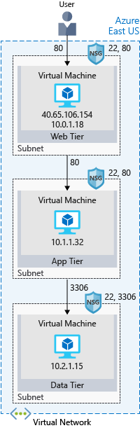

# Deploy your site to Azure

## Learning Objectives

We will learn:

- How an Azure virtual network provides secure network communication among resources surch as VMs and other networks
- What high availability and high resiliency mean, plus - how Azure Load Balanacer can increase resiliency within a single geographic region
- What latency is, plus - how Traffic Manager helps reduce network letency and provides resiliency across geographic locations

We have a start up business selling vitamins that we want to move from on-prem to Azure cloud.

Big companies' systems are usually comprised of a bunch of connected apps and services that work together - lets call them the components of that system. For example, Front end, back end, web services, databases etc.

There are patterns used by software architects to make these systems easier to work with. Loosely coupled architectures is one of those strategies.

## Benefits of Loosely Coupled Architectures

It's best to loosely couple the components of your system. The components being, the front end, back end, web services etc.

**Loosely coupled**: Each component in the system has little to no knowledge of the definitions of the other components

The components simply need to send and recieve data.

They dont need to know how that data is created or processed by other components in the system.

However, the components do need to agree on a standard form of communication.

So - they need to be loosely coupled!

### Ok but why is this important

Well, loosely coupled systems can be updated independently.

So a developer can make changes to a component - as long as the agreed standard form of communication stays consistent.

It also allows components to be replaced without much impact to the rest of the system. For example, if a faster storage option was released by Azure, and we wanted to upgrade our current storage component to this newer faster component. As long as the new one could understand the same data, and send and receive data in the agreed standard form of communication with our other components, we can replace it.

We can also upgrade parts of our system with minimal impact to existing components. For example, if we wanted to do data processing before storing the data, we could add a data processing component inbetween the data storage component and the component sending the data. All we'd have to change is the data messaging flow to route through this new component.

One last benefit of loosely coupled systems, is that it allows components in the system to be scaled independently. This means we can scale up or scale out only the components that would truely benefit from the addtional resources.

Loosely coupled systems are fundamental to Azures data communication strategy.

## N-tier architecture

N-tier is an architectural pattern that can be used to build loosely coupled systems.

N-tier divides an app into two or more logical tiers.

A higher tier can access services from a lower tier, but a lower tier shiould never access a higher tier.

Tiers help seperate concerns and are ideally designed to be reuseable.

Tiers can be updated or replaced independently and new tiers can be inserted if need be - this also simplifies maintenance.

A 3-tier app is an app that uses the N-tier architectural pattern that has 3 tiers.

Our vitamin startup ecommerce web app uses a 3-tier architecture:

- Web tier - provides the web interface to the users - the frontend
- Application tier - runs the business logic
- Data tier - databases and storage that hold customer and product information

Each of these tiers could be hosted on an Azure VM for example.

### What's a virtual network

It's a logically isolated network on Azure.

A virtual network allows Azure resources to securely communicate with each other, the internet, and on-prem networks.

A virtual network is scoped to a single region, but multiple virtual networks from different regions can be connected together using *virtual network peering.*

Virtual networks can be segemented into one or more subnets.

Subnets organize and secure resources into sections. The web, application and data tiers each have their own VM. All 3 VMs are in the same virtual network, but are in seperate subnets.

Users interact with the web tier directly from the internet. So that VM has a public IP address along with a private IP address. Users dont interact with the application or data tiers so these VMs only have private IP addresses.

You could also keep you data storage tiers in an on-prem network, while placing your web tier in the cloud. A VPN gateway (or virtual network gateway) allows for this. It provides a secure connection between an on-prem location and an Azure Virutal Network.

Azure manages the physical hardware of a virtual network for you. You just configure the software and you can treat the virtual network just like your own network. It's SaaS.

### What's a network security group

A NSG is allows or denies inbound network traffic to your Azure resources. It's basically a cloud-level firewall for your network.

In the picture above the VM in the web tier allows inbound traffic from ports 22 (SSH) and port 80 (http). You can configure a network security group (NSG) to accept traffic from only known sources, such as IP addresses you trust.

Virtual networks enable you to group and isolate related systems. You define network security groups (NSG) to control what traffic can flow through a virtual network.

Leaving port 22 open is just for learning purposes in this example, in practice you'd want to configure VPN access to your virtual network as that is more secure.
